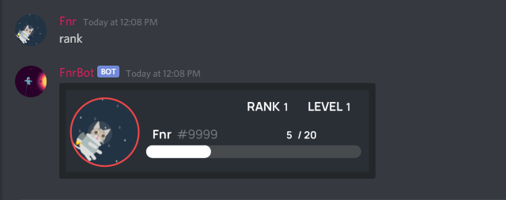

# Rank-System by Fnr#9999

<h1 align="center"></h1>

- get started

1- First create file named "config.json"<br>2- npm install

- config.json
```
{
    "token": "Your discord bot token"
}
```

**It's simple rank system like mee6 bot you can add xp etc...**

**Thanks for using me** 
